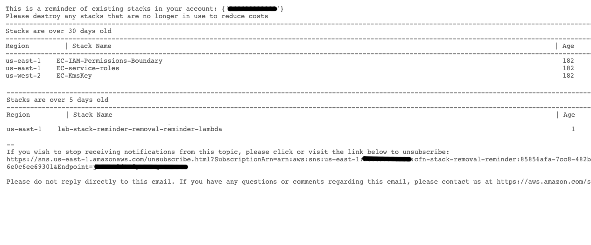

# Cloudformation Stack Reminder Tool
Simple serverless project that deploys an event bridge event, a lambda and an sns topic. Together, these resources will notify you weekly of any Cloudformation stacks left in your account and sort them by Age.

Here is an example of the email that is received:

## Prerequites
Serverless to deploy the code
https://www.serverless.com/framework/docs/getting-started

Using NPM:
`npm install -g serverless` 

## How to deploy:
1. Clone this repo to your local environment.
2. Authenticate into the account in which you intend on deploying this tool in.
3. Change the variables in the vars.env to suit your needs.
4. Deploy the tool using Serverless `sls deploy`.
5. After deployment, confirm the subscription in your email inbox.

### To test: 
You must confirm the subscription before you test the lambda otherwise the emails will not send.
1. Navigate to the cfn-stack-removal-reminder lambda and create a test. The event data for this test is not important because the lambda itself does not use the data.

## How to Destroy:
1. Authenticate into the account in which you deployed this tool in.
2. Destroy the stack using Serverless `sls destroy`.
